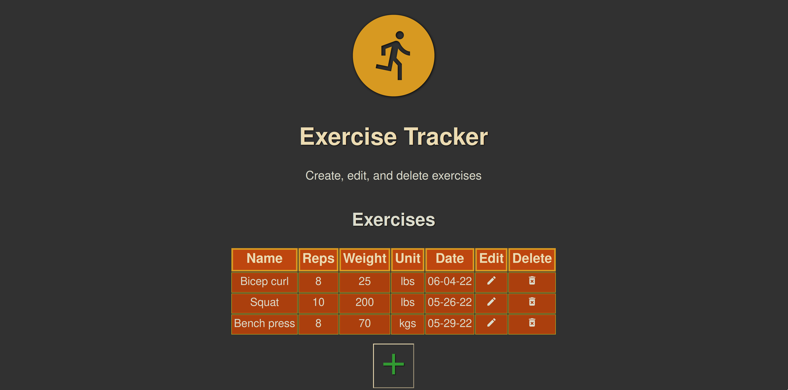
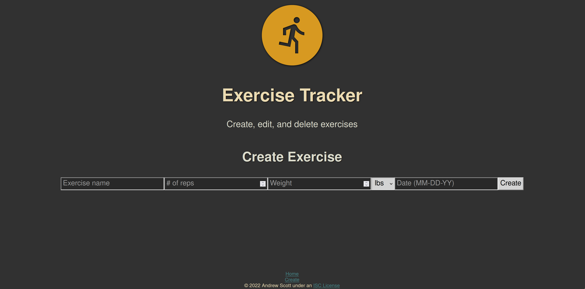
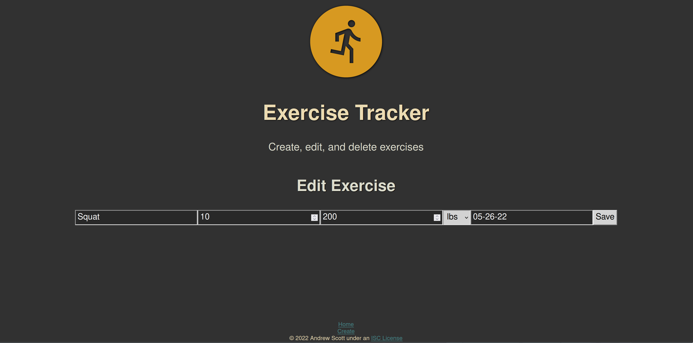

# ExerciseTracker

This single page application uses the MongoDB, Express, React, and Node (MERN)
Stack to implement a REST API and a graphical interface for logging exercises.
The home page greets the user with a table of past exercises. An exercise can
be edited, or deleted, by clicking on the appropriate icon within the table.

Click the "plus" button on the home page to create a new exercise,
and enter the details such as the name of the exercise and the number of
repititions. Alternatively, use the links section at the bottom of the
page to navigate the site.

Note that when creating or editing an exercise the data is
validated to help ensure accurate input. For example, the server verifies that
"weight" and "reps" are integers, while "name" must be a string.

After editing or creating an exercise the user is taken back to the home page to view the
updated table.
